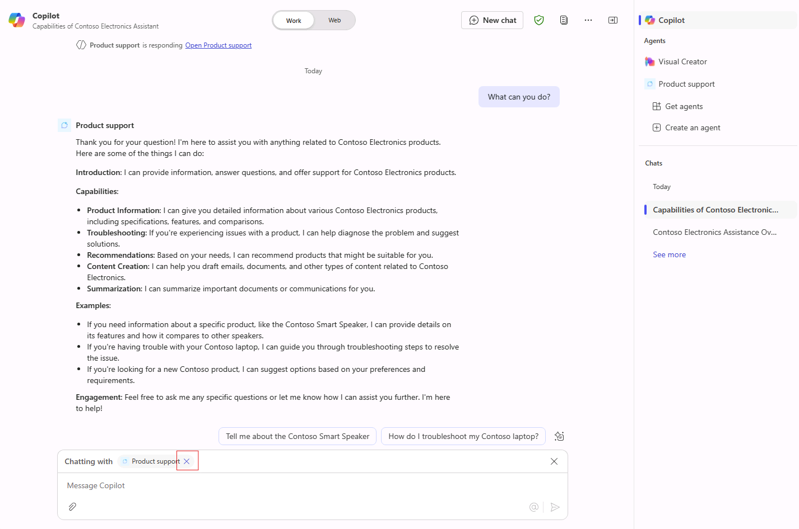

---
lab:
  title: 1.1 宣言型エージェントを作成する
---

# 宣言型エージェントを作成する

この演習では、生成 AI を使用して宣言型エージェントを作成し、指示を改善し、エージェントを Microsoft 365 に公開し、Microsoft 365 Copilot でエージェントをテストします。

この演習の所要時間は約 **20** 分です。

## 生成 AI を使用して宣言型エージェントを作成する

まず、Copilot Studio で新しい宣言型エージェントを作成します。 生成 AI を使用して、エージェントの指示とプロパティを下書きします。

1. Web ブラウザーで、[Microsoft Copilot Studio](https://copilotstudio.microsoft.com/) (`https://copilotstudio.microsoft.com`) に移動します。
1. Copilot Studio で作成するアクセス許可がある職場または学校アカウントを使用して、サインインします。
1. **[Microsoft Copilot Studio へようこそ]** ページにメッセージが表示されたら、国/地域を選択してから **[使用開始]** を選択します。
1. **[Copilot Studio へようこそ]** ポップアップが表示された場合は、 **[スキップ]** を選択します。
1. Copilot Studio に移動すると、新しいエージェントを作成するための対話的インターフェイスが最初に開く可能性があります。 このウィザードは、*カスタム* エージェントを設定するのに役立ちます。  **[...]** を選択したあと、**[エージェント作成のキャンセル]** を選択して、このウィザードを終了します。  **[移動]** を選択して確定します。

    

1. 左側のナビゲーション パネルで **[エージェント]** に移動します。
1. エージェント ページから **[Microsoft 365 Copilot]** を選択します。
1. **[Microsoft 365 Copilot エージェント]** ページで、[エージェント] セクション内の **[追加]** を選択します。

    ![Copilot Studio の [Microsoft 365 Copilot エージェント] ページのスクリーンショット。](../Media/add-copilot-agent.png)

    作成するエージェントを記述できる対話的作成エクスペリエンスが表示されます。

1. エージェントの機能を説明するように求められます。  対話的インターフェイスの **[メッセージを入力してください]** テキスト ボックスに、次のように入力します。

    ```md
    I'd like to create a product support agent that answers questions related to Contoso Electronics products.
    ```

1. **[入力]** または **[送信]** を選択して、メッセージを送信します。
1. エージェントの名前を提案するように求められたら、「`Product support`」と入力してメッセージを送信します。
1. 対話的インターフェイスの上部にある **[構成に進む]** を選択して、エージェントの概要ページを表示し、生成 AI がそれまでに構成した内容を確認します。

## エージェントを構成し指示を定義する

次に、エージェントのプロパティとメタデータを手動で更新します。

1. 生成 AI ウィザードによってエージェントに定義された **[名前]** を確認します。 名前を更新して `Product support` になるようにします。
1. **description** プロパティの値を `A product support agent that can answer queries about Contoso Electronics products` に更新します。
1. **[指示]** テキスト ボックスに、次のように入力します。
  
    ```md
        You are an agent tasked with answering questions about Contoso Electronics products. Start every response to the user with "Thanks for using a Copilot agent!\n\n" and then answer the questions and help the user.
    ```

1. ページの上部にある **[作成]** を選択して、エージェントを作成します。  しばらくすると、エージェントの概要ページが表示されます。

## Copilot Studio でエージェントをテストする

次に、Microsoft 365 Copilot に公開する前に、Copilot Studio 内のテスト ウィンドウでエージェントの動作をテストします。

1. **Product support** エージェントの概要ページの **[公開の詳細]** セクションで、エージェントがまだ公開されていないことに注意してください。

    

1. エージェントの概要情報の右側に **[エージェントのテスト]** ウィンドウが表示されない場合は、[公開] ボタンの横にある **[テスト]** ボタンを選択して、テスト ウィンドウを開きます。
1. テキスト ボックスに「`What can you do?`」と入力し、メッセージを送信します。
1. 応答を待ちます。 応答が "Copilot エージェントをご利用いただき、ありがとうございます。" というテキストで始まることに注目してください。 これは、前に定義したエージェントへの指示どおりです。

    

    また、現在、エージェントには指示はありますが、カスタム ナレッジ ソースやアクションはまだないことに注意してください。 Contoso 製品に関する質問に回答するようにエージェントをまだ構成していません。 これは次の演習で行います。

    > [!NOTE]
    > エージェントを編集する必要がある場合は、テスト ウィンドウを閉じ、エージェントの概要ページの **[詳細]** セクションで **[編集]** を選択します。 もう一度テストする前に、テスト ウィンドウ内の **[更新]** ボタンを選択して、最新の変更を読み込みます。

## エージェントを Microsoft 365 Copilot に公開する

次に、宣言型エージェントを Microsoft 365 Copilot に公開します。 **Product support** エージェントの概要ページから、以下を行います。

1. **[発行]** ボタンを選びます。 Microsoft 365 Copilot および Microsoft Teams のユーザーに表示されるエージェントの情報を入力するように求められます。

    > [!NOTE]
    > このフォームの情報は、組織の Office および Teams カタログのカタログ エントリと Microsoft 管理センターの統合アプリ一覧に入力するために使用されます。 エージェントを呼び出すために Microsoft 365 Copilot の言語モデルで使用されるわけではありません。

1. **[簡単な説明]** テキスト ボックスに「`Answers questions about Contoso Electronics products`」と入力します。
1. 残りのフィールドには、既定の提案をそのまま使用します。
1. **公開**を選択します。
1. エージェントが公開されるまで待ちます。  公開中にモーダル ウィンドウを閉じないでください。 これには数分かかることがあります。

    > [!NOTE]
    > [公開] を選択すると、エージェントに対応するボット リソースがテナントの Microsoft Entra ID 環境にプロビジョニングされます。 このリソースを使用すると、Microsoft Teams でエージェントとやり取りできます。

1. エージェントが公開されると、**[可用性オプション]** ウィンドウが表示されます。
1. **[共有リンク]** で **[コピー]** を選択してエージェントの共有リンクをコピーしたあと、**[完了]** を選択します。
1. エージェントが公開されたことがエージェントの概要ページの **[公開の詳細]** セクションに表示されていることに注目してください。

    ![Copilot Studio での Product support エージェントの [公開の詳細] セクションのスクリーンショット。](../Media/publish-details.png)

    共有リンクをもう一度コピーする必要がある場合は、**[公開の詳細]** セクションで **[可用性オプション]** を選択します。

1. Web ブラウザーで新しいタブを開き、共有リンクを URL バーに貼り付けて、**Enter** キーを押します。 モーダル ウィンドウが開いて、エージェントの概要が表示されます。 ここには、公開時に提供した、エージェントに関するユーザー向けの情報と、エージェントに必要なアクセス許可が表示されます。

    

1. **[追加]** を選択して、エージェントを Microsoft 365 Copilot に追加します。
1. エージェントが追加されるまで待ちます。 エージェントは Microsoft 365 Copilot で起動されます。

## エージェントを Microsoft 365 Copilot でテストする

次に、宣言型エージェントを Microsoft 365 Copilot で実行し、その機能を**イマーシブ** エクスペリエンスと**コンテキスト内**エクスペリエンスの両方で検証しましょう。

前の手順に従って、現在、**イマーシブ** エージェント エクスペリエンスを使用しています。 右側の **[エージェント]** ウィンドウで、現在直接チャットしているエージェントとして **Product support** が選択されていることに注目してください。


1. テキスト ボックスに「`What can you do?`」と入力し、メッセージを送信します。
1. メッセージを送信し、応答を待ちます。 応答が "質問をありがとうございます。" というテキストで始まることに注目してください。 これは、エージェントへの指示で指定したガイダンスに従っています。

ブラウザーで続けて、**コンテキスト内**エクスペリエンスをテストしてみましょう。

1. チャットウィンドウの右側にある **[エージェント]** ウィンドウの上にある **[Copilot]** を選択して、**Product support** エージェントとのイマーシブ チャットを終了し、Microsoft 365 Copilot とチャットします。

    ![Microsoft 365 Copilot のサイドバーにある [Copilot] ボタンのスクリーンショット。](../Media/select-copilot.png)

1. メッセージ ボックスに、<kbd>@</kbd> 記号を入力します。 使用可能なエージェントの一覧を示すポップアップが表示されます。

    

1. ポップアップで **Product support** を選択します。 メッセージ ボックスの上にあるステータス メッセージに注目してください。 **Chatting with Product support** が表示されます。これは、エージェントのコンテキスト内エクスペリエンスを使用していることを示します。

    

1. テキスト ボックスに「`What can you do?`」と入力し、メッセージを送信します。

1. 応答を待ちます。 応答が "質問をありがとうございます。" というテキストで始まることに注目してください。 これは、エージェントへの指示で指定したガイダンスに従っています。

1. コンテキスト内エクスペリエンスを終了するには、ステータス メッセージでバツ印 (X) を選択します。 ステータス メッセージが削除され、エージェントとのチャットが終了したことを示すメッセージがチャット ウィンドウに表示されます。

    

これで、Microsoft 365 Copilot のイマーシブ エクスペリエンスとコンテキスト内エクスペリエンスの両方でエージェントをテストしました。
