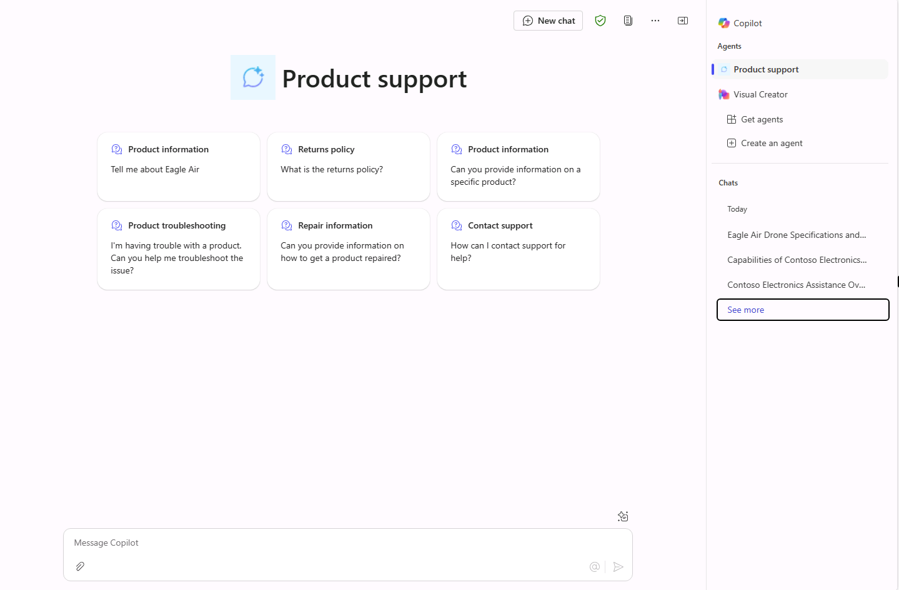

---
lab:
  title: '1.3:提案されたプロンプトを追加する'
  description: この演習では、前の演習で作成した宣言型エージェントを更新して 6 つの適切なおすすめプロンプトを追加します。
  duration: 10 minutes
  level: 200
  islab: true
---

# 提案されたプロンプトを追加する

この演習では、前の演習で作成した宣言型エージェントを更新して 6 つの適切なおすすめプロンプトを追加します。

この演習の所要時間は約 **10** 分です。

## 提案されるプロンプトを定義する

Copilot Studio で以下を行います。

1. **Product support** エージェントの **[概要]** ページに移動します。
1. 会話型エージェント作成ウィザードで、作成時にエージェントに対して推奨プロンプトが生成される場合があります。 その場合は、エージェントの機能に基づいて、これらを、より適切なプロンプトに置き換えてみましょう。
1. **[推奨プロンプト]** セクションで、エージェントの作成時にプロンプトが生成されたかどうかに応じて、**[編集]** アイコンまたは **[推奨プロンプトを追加]** ボタンを選択します。
1. 既存のプロンプトを以下に置き換えます。

      `Eagle Air` : `Tell me about Eagle Air`

      `Return policy` : `What is the returns policy`              

      `Product information` : `Can you provide information on a specific product?` 

      `Product troubleshooting` : `I'm having trouble with a product. Can you help me troubleshoot the issue?` 

      `Repair information ` : `Can you provide information on how to get a product repaired?`
      
      `Contact support` : `How can I contact support for help?`

1. **[保存]** を選択して変更を保存します。 

## エージェントを再公開する

更新したエージェントを Microsoft 365 Copilot に公開しましょう。

1. エージェントの変更が正常に保存されたら、Copilot Studio のエージェントの概要ページの右上にある **[公開]** を選択します。
1. 開いたモーダル ウィンドウで、**[公開]** を選択します。
1. 開いた **[可用性オプション]** ウィンドウで、**[共有リンク]** 見出しの下にある **[コピー]** を選択します。

    ![[可用性オプション] ウィンドウのスクリーンショット。](../Media/availability-options-share-link.png)
1. Web ブラウザーの別のタブで、エージェントの共有リンクを**貼り付け**て **Enter** キーを押します。 **Product support** エージェントについて説明するウィンドウが表示されます。
1. 変更が製品サポート エージェントに公開されるまで、少し待ちます。
   > [!NOTE]
   > 新たに公開された推奨プロンプトが Microsoft 365 Copilot に表示されるまでに数分かかることがあります。 すぐに表示されない場合は数分待ってから **[新しいチャット]** を選択し、もう一度 **[製品サポート]** を選択してみてください。 プロンプトが、新しい空のセッションに表示されます。
1. 更新が完了したら、Copilot Studio に戻り、モーダル ウィンドウを閉じます。 Web ブラウザーが **Microsoft 365 Copilot** に遷移しない場合は、ページ左上の **[アプリ起動ツール]** アイコン (グリッドアイコン) を使って **Microsoft 365 Copilot** にアクセスします。

## エージェントを Microsoft 365 Copilot でテストする

1. **Microsoft 365 Copilot** のサイド パネルのエージェントの一覧で **Product Support** を見つけ、それを選択し、イマーシブ エクスペリエンスを入力して、エージェントと直接チャットします。 Copilot Studio で定義したおすすめプロンプトがユーザー インターフェイスに表示されることに注目してください。

    

1. おすすめプロンプトを選択し、メッセージを送信して、応答を確認します。
