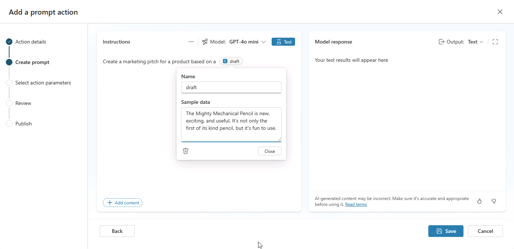

---
lab:
  title: '2.1: プロンプト アクションを作成する'
---

# プロンプト アクションを作成する

この演習では、プロンプト アクションを作成し、Copilot Studio でプロンプトをテストし、Copilot エージェント内でプロンプトをテストします。 ユーザーが生のアイデアを、特定の形式とガイドラインに従う整理されたマーケティング ピッチに変えるのに役立つプロンプト アクションを作成します。

この演習の所要時間は約 **15** 分です。

## Copilot Studio でプロンプト アクションを作成する

1. Web ブラウザーで [Copilot Studio](https://copilotstudio.microsoft.com) (`https://copilotstudio.microsoft.com`) に移動して、Copilot Studio を開きます。
1. 左側のナビゲーションから **[ライブラリ]** を選択します。
1. **[新規追加]** を選択し、**[プロンプト]** を選択します。 **[プロンプト アクションの追加]** ウィザードが開きます。
1. **[アクション名]** フィールドに「`Create a Contoso Marketing Pitch`」と入力します。
1. **[説明]** フィールドに「`Create a marketing pitch that follows Contoso guidelines`」と入力したあと、**[次へ]** を選択します。 **[プロンプトの作成]** ページが表示されます。
1. **[指示]** テキスト ボックスに「`Create a marketing pitch for a product based on a `」と入力します。
1. 入力した文の末尾にカーソルを置いて、**[コンテンツの追加]** を選択します。
1. **[テキスト]** を選択します。
1. **[名前]** フィールドに「`draft`」と入力します。
1. **[サンプル データ]** フィールドに「`The Mighty Mechanical Pencil is new, exciting, and useful. It's not only the first of its kind pencil, but it's fun to use.`」と入力して、**[閉じる]** を選択します。

    

## プロンプトをテストし改善する

1. 指示ボックスの上にある **[テスト]** を選択して、指定したサンプル データでプロンプトをテストします。
1. テストの実行の出力を確認します。

より構造化された一貫性のある出力を作成するようにプロンプトを改善しましょう。

1. **[指示]** テキストボックスで、既存の指示に以下を追加してプロンプトを変更します。

    ```The pitch should follow the following Contoso guidelines:
       - Start with a brief hook
       - Describe unique value proposition
       - End with a call-to-action
       - Use an exciting and influential tone
    ```

1. もう一度 **[テスト]** を選択して、プロンプトを再テストします。
1. 応答の違いに注目してください。
1. **[保存]** を選択します。

## アクションを構成して公開する

1. **[アクション パラメーターの選択]** ページで、`draft` 入力変数の**説明**を `initial draft of the marketing pitch` と指定します。
1. `text` 出力変数の**説明**を `Final marketing pitch that adheres to Contoso guidelines` と指定します。
1. [**次へ**] を選択します。
1. 詳細を正しく入力したことを確認し、**[公開]** を選択します。
1. アクションが保存されて公開されるまで、しばらく待ちます。
1. これで、アクションをライブラリで使用できるようになりました。 **保存して閉じる**を選択します。

   > **注**: 新しいプロンプト アクションがエージェントの **[アクションの追加]** ページの **[おすすめ]** セクションまたは **[ライブラリ]** セクションに表示されるまで、数分以上かかる場合があります。

## (省略可能) エージェントにプロンプト アクションを追加する

前のラボを完了し、宣言型エージェントを作成した場合は、このアクションをエージェントに追加し、アクションを参照するようにエージェントの指示を更新することができます。

### アクションを追加する

1. **[ライブラリ]** から、アクションを追加する宣言型エージェントを選択します。
1. **[詳細]** セクションで **[編集]** を選択します。
1. **[指示]** テキスト ボックスで、既存の指示テキストに「`Use the Contoso Marketing Pitch action to help marketing stakeholders craft pitches for products based on their draft ideas.`」を追加します。
1. エージェントの詳細ページの **[アクション]** で、**[アクションの追加]** を選択します。
1. **[アクションの追加]** モーダル ウィンドウの **[おすすめ]** セクションまたは **[ライブラリ]** セクションで、**Contoso Marketing Pitch** を選択します。
1. アクション ページで、**[名前]** が `Create a Contoso Marketing Pitch` になっていることを確かめます。
1. **[説明]** が `Create a marketing pitch that follows the Contoso guidelines` になっていることを確認します。
1. **アクションの追加**を選択します。 これには数分かかることがあります。 **[アクション]** で、エージェントで使用できるアクションの一覧にこのアクションが追加されます。

### アクションを構成する

1. エージェントで使用できるアクションから、`Contoso Marketing Pitch` アクションを選択します。 アクションのプロパティと設定を構成するためのページが表示されます。
1. **[アクション名]** が `Create a new Contoso marketing pitch` に設定されていることを確認します。
1. アクション内の上部ナビゲーションで **[入力]** を選択します。
1. **[追加入力]** で **[追加]** を選択します。
1. **Draft** 変数を選びます。 フォームが表示されます。
1. **[エージェントは、この入力をどのように入力しますか]** フィールドが **[最適なオプションで動的に入力する (既定)]** に設定されていることを確認します。
1. **[表示名]** フィールドに、「`Initial draft`」と入力します。
1. **[識別形式]** フィールドが **[ユーザーの応答全体]** に設定されていることを確認します。
1. ウィンドウの右上にある **[保存]** を選択します。

## (省略可能) プロンプト アクションを Copilot Studio でテストする

次に、Copilot Studio でアクションを使用してエージェントをテストします。

1. Copilot Studio でエージェントの概要ページの **[エージェントのテスト]** ウィンドウから、**[更新]** ボタンを選択してテスト ウィンドウを最新の情報に更新し、エージェントの最新の変更点を読み込みます。
1. テスト会話のテキスト ボックスに「`Create a Contoso marketing pitch based on the following draft: "Bouncy ball is the hottest product on the market for both youth and adults. It's durable and the largest of its kind."`」と入力し、メッセージを送信します。
1. 応答を確認し、カスタム プロンプト アクションの指示で指定したガイダンスにエージェントが従っていることに注意します。

以上で、演習を完了し、プロンプト アクションの機能を検証しました。
