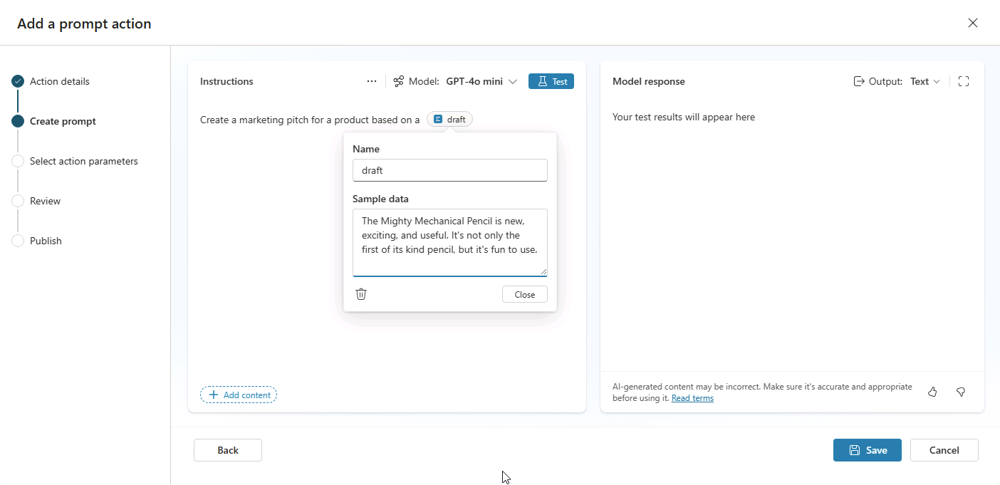

---
lab:
  title: '2.1: プロンプト アクションを作成する'
---

# プロンプト アクションを作成する

この演習では、プロンプト アクションを作成し、Copilot Studio でプロンプトをテストし、Copilot エージェント内でプロンプトをテストします。 ユーザーが生のアイデアを、特定の形式とガイドラインに従う整理されたマーケティング ピッチに変えるのに役立つプロンプト アクションを作成します。

この演習の所要時間は約 **15** 分です。

## Copilot Studio でカスタム プロンプトを作成する

1. Web ブラウザーで [Copilot Studio](https://copilotstudio.microsoft.com) (`https://copilotstudio.microsoft.com`) に移動して、Copilot Studio を開きます。
1. 左側のナビゲーションから **[ツール]** を選択します。
1. **[+ 新しいツール]** を選択します。
1. [新しいツール] ポップアップ ウィンドウで、**[プロンプト]** を選択します。 プロンプト ビルダー UI に移動します。
1. **[指示]** テキスト ボックスに「`Create a marketing pitch for a product based on a `」と入力します。
1. 入力した文の末尾にカーソルを置いて、**[コンテンツの追加]** を選択します。
1. **[テキスト]** を選択します。
1. **[名前]** フィールドに「`draft`」と入力します。
1.  **[サンプル データ]** フィールドに「`The Mighty Mechanical Pencil is new, exciting, and useful. It's not only the first of its kind pencil, but it's fun to use.`」と入力して、**[閉じる]** を選択します。

    

## プロンプトをテストし改善する

1. 指示ボックスの上にある **[テスト]** を選択して、指定したサンプル データでプロンプトをテストします。
1. テストの実行の出力を確認します。

より構造化された一貫性のある出力を作成するようにプロンプトを改善しましょう。

1. **[指示]** テキストボックスで、既存の指示に以下を追加してプロンプトを変更します。

    ```The pitch should follow the following Contoso guidelines:
       - Start with a brief hook
       - Describe unique value proposition
       - End with a call-to-action
       - Use an exciting and influential tone
    ```

1. もう一度 **[テスト]** を選択して、プロンプトを再テストします。
1. 応答の違いに注目してください。
1. **[保存]** を選択します。

## プロンプトを構成して発行する

プロンプトを保存すると、**[エージェントで使用するための構成]** ウィンドウが表示されます。

1. **[名前]** フィールドに「`Create a Contoso Marketing Pitch`」と入力します。
1. **このツールを使用するタイミングをエージェントが知るための [説明]** フィールドに「`Create a marketing pitch that follows Contoso guidelines`」と入力し、**[次へ]** を選択します。 **[プロンプトの作成]** ページが表示されます。
1. **[追加]** を選択します。

## (省略可能) エージェントにプロンプト アクションを追加する

前のラボを完了し、宣言型エージェントを作成した場合は、このアクションをエージェントに追加し、アクションを参照するようにエージェントの指示を更新することができます。

### プロンプト ツールを追加する

1. Copilot Studio のサイドバーから **[エージェント]** を選択します。
1. **[Microsoft 365 Copilot]** を選択します。
1. **[エージェント]** の下にある、アクションを追加する **Product Support** エージェントを選択します。
1. ページの **[ツール]** セクションから **[ツールの追加]** を選択します。
1. **[プロンプト]** フィルターを選択します。
1. 「**Contoso のマーケティング提案作成してください**」プロンプトを選択します。
1. **[エージェントへの追加]** を選択します。 このツールは、Product Support エージェントの **[ツール]** に表示されるようになります。

### エージェントの指示を更新する

エージェントの指示を更新して、プロンプトの使用に関するガイダンスを指定します。

1. **[指示]** テキスト ボックスで、既存の指示テキストに「`Use the Contoso Marketing Pitch action to help marketing stakeholders craft pitches for products based on their draft ideas.`」を追加します。

演習が完了し、エージェントのプロンプト ツールが作成されました。
